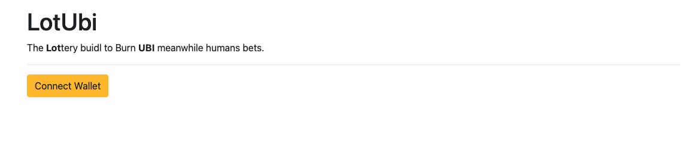
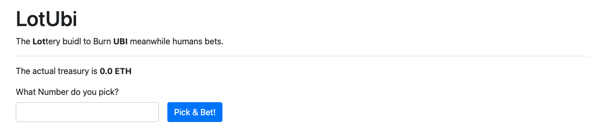
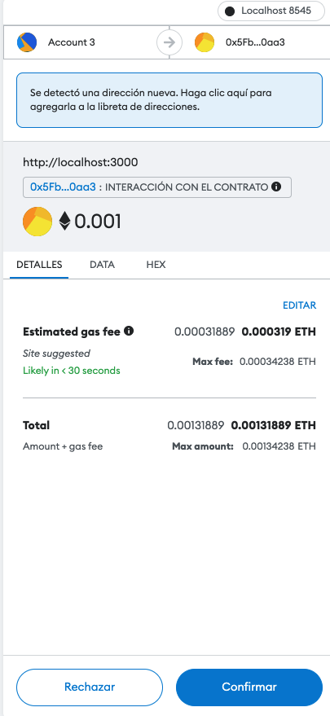
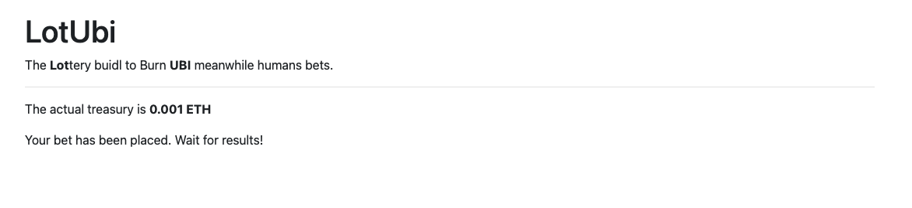

# lotubi-poc [Experimental]

Training my web3 skills with TDD. Do not deploy this contracts to mainnet.

### Preview

The main page ask you to connect a wallet (only tested with Metamask).

Once connected, you can see the *lotubi contract* actual treasury. 
Also, you can pick a number (for the moment, numbers between 1 and 10).  

When you press Pick & Bet, the wallet will ask you to confirm a 0.001 ETH transaction.
This will be sended to the contract treasury.

If the transaction is confirmed and mined, you will see the treasury updated.

### Local development

- Install [hardhat](https://hardhat.org/getting-started#quick-start)
- Set-up a hardhat node with `npx hardhat node`
- Deploy contract with `npx hardhat --network localhost run scripts/local_deploy.js`
- Run UI with `cd ui` and `npm start`. More details in [ui readme](ui/README.md)

### Contract next steps

- Security/modifiers review.
- Split the reward to send 50% to UBIBurner Contract.
- Allow lottery status changes.
- Claim rewards for winners.
- Integration with ChainLink for randomness.

### Frontend Next stepss

- Support lottery status changes.
